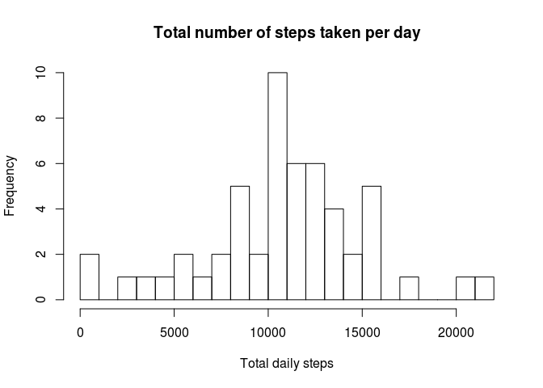
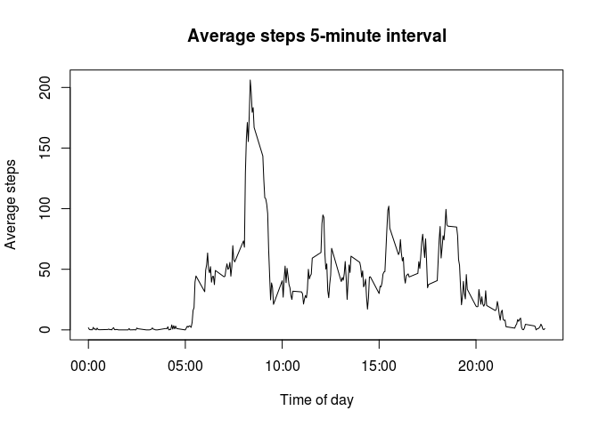
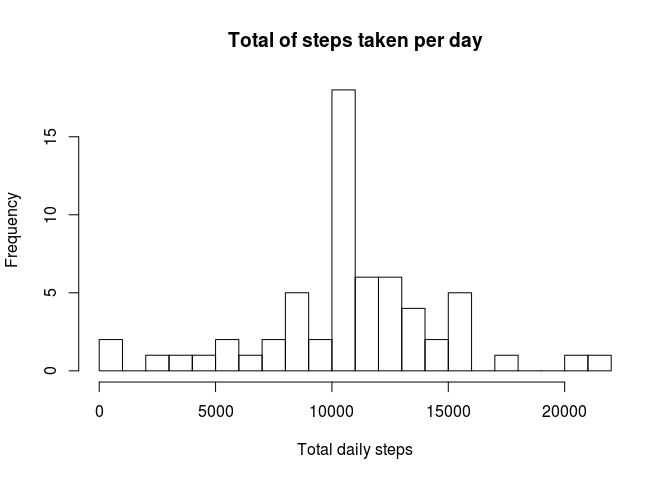
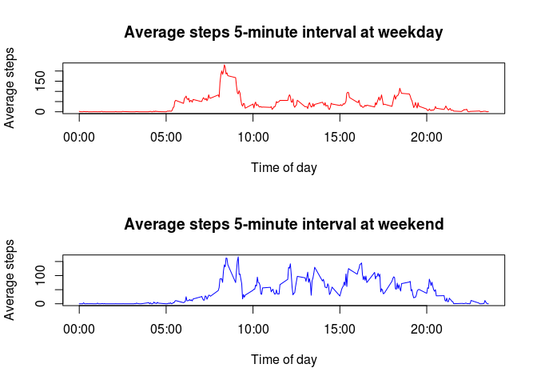

# Reproducible Research: Peer Assessment 1


## Loading and preprocessing the data

```r
setwd("~/rworkspace/reproducibleresearch/peer-assessments1/RepData_PeerAssessment1")
data <- read.csv(unz("activity.zip", "activity.csv"))
```
- Head of the activity dataset

```r
head(data)
```

```
##   steps       date interval
## 1    NA 2012-10-01        0
## 2    NA 2012-10-01        5
## 3    NA 2012-10-01       10
## 4    NA 2012-10-01       15
## 5    NA 2012-10-01       20
## 6    NA 2012-10-01       25
```

## What is mean total number of steps taken per day?

1. Calculate the total number of steps taken per day

```r
result1 <- tapply(data$steps,data$date,sum)
```
- Data for total number of steps taken per day

```r
result1
```

```
## 2012-10-01 2012-10-02 2012-10-03 2012-10-04 2012-10-05 2012-10-06 
##         NA        126      11352      12116      13294      15420 
## 2012-10-07 2012-10-08 2012-10-09 2012-10-10 2012-10-11 2012-10-12 
##      11015         NA      12811       9900      10304      17382 
## 2012-10-13 2012-10-14 2012-10-15 2012-10-16 2012-10-17 2012-10-18 
##      12426      15098      10139      15084      13452      10056 
## 2012-10-19 2012-10-20 2012-10-21 2012-10-22 2012-10-23 2012-10-24 
##      11829      10395       8821      13460       8918       8355 
## 2012-10-25 2012-10-26 2012-10-27 2012-10-28 2012-10-29 2012-10-30 
##       2492       6778      10119      11458       5018       9819 
## 2012-10-31 2012-11-01 2012-11-02 2012-11-03 2012-11-04 2012-11-05 
##      15414         NA      10600      10571         NA      10439 
## 2012-11-06 2012-11-07 2012-11-08 2012-11-09 2012-11-10 2012-11-11 
##       8334      12883       3219         NA         NA      12608 
## 2012-11-12 2012-11-13 2012-11-14 2012-11-15 2012-11-16 2012-11-17 
##      10765       7336         NA         41       5441      14339 
## 2012-11-18 2012-11-19 2012-11-20 2012-11-21 2012-11-22 2012-11-23 
##      15110       8841       4472      12787      20427      21194 
## 2012-11-24 2012-11-25 2012-11-26 2012-11-27 2012-11-28 2012-11-29 
##      14478      11834      11162      13646      10183       7047 
## 2012-11-30 
##         NA
```
2.  Make a histogram of the total number of steps taken each day

```r
result1 <- tapply(data$steps,data$date,sum)

hist(result1,xlab="Total daily steps", breaks=25,main="Total number of steps taken per day")
```

 

3. Calculate and report the mean and median of the total number of steps taken per day


```r
total_daily_steps <- as.numeric(tapply(data$steps, data$date, sum))
steps.mean <- mean(total_daily_steps,na.rm= TRUE)
steps.median <- median(total_daily_steps,na.rm=TRUE)
```
- Mean of the total number of steps per day

```r
steps.mean
```

```
## [1] 10766.19
```
- Median of the total number of steps per day

```r
steps.median
```

```
## [1] 10765
```

## What is the average daily activity pattern?

1. Make a time series plot (i.e. type = "l") of the 5-minute interval (x-axis) and the average number of steps taken, averaged across all days (y-axis)


```r
data$interval <- as.factor(as.character(data$interval))
interval.mean <- as.numeric(tapply(data$steps, data$interval, mean, na.rm = TRUE))
intervals <- data.frame(intervals = as.numeric(levels(data$interval)), interval.mean)
intervals <- intervals[order(intervals$intervals), ]

labels <- c("00:00", "05:00", "10:00", "15:00", "20:00")
labels.at <- seq(0, 2000, 500)
plot(intervals$intervals, intervals$interval.mean, type = "l", main = "Average steps 5-minute interval", 
    ylab = "Average steps", xlab = "Time of day", xaxt = "n")
axis(side = 1, at = labels.at, labels = labels)
```

 


2. Which 5-minute interval, on average across all the days in the dataset, contains the maximum number of steps?

```r
intervals.sorted <- intervals[order(intervals$interval.mean, decreasing = TRUE), 
    ]
head(intervals.sorted)
```

```
##     intervals interval.mean
## 272       835      206.1698
## 273       840      195.9245
## 275       850      183.3962
## 274       845      179.5660
## 271       830      177.3019
## 269       820      171.1509
```

```r
max.interval <- intervals.sorted$intervals[1[1]]
max.interval
```

```
## [1] 835
```
- Therefore, the interval between 08:35 and 08:40 minutes has the maximum number of step

## Imputing missing values
1. Calculate and report the total number of missing values in the dataset (i.e. the total number of rows with NAs)


```r
dim(data[is.na(data$steps), ])[1]
```

```
## [1] 2304
```
- The total number of missing values in the dataset (i.e. the total number of rows with NAs) is 2304.


2. Devise a strategy for filling in all of the missing values in the dataset. The strategy does not need to be sophisticated. For example, you could use the mean/median for that day, or the mean for that 5-minute interval, etc.

- The strategy for filling in all of the missing values in the dataset is to change the “NA"s to the mean values for that 5-minute interval.


```r
steps <- vector()
for (i in 1:dim(data)[1]) {
    if (is.na(data$steps[i])) {
        steps <- c(steps, intervals$interval.mean[intervals$intervals == data$interval[i]])
    } else {
        steps <- c(steps, data$steps[i])
    }
}
```

3. Create a new dataset that is equal to the original dataset but with the missing data filled in.


```r
activity_without_missing_data <- data.frame(steps = steps, date = data$date, 
    interval = data$interval)
```

- Head of the dataset with the missing data filled in 


```r
head(activity_without_missing_data)
```

```
##       steps       date interval
## 1 1.7169811 2012-10-01        0
## 2 0.3396226 2012-10-01        5
## 3 0.1320755 2012-10-01       10
## 4 0.1509434 2012-10-01       15
## 5 0.0754717 2012-10-01       20
## 6 2.0943396 2012-10-01       25
```
4. Make a histogram of the total number of steps taken each day and Calculate and report the mean and median total number of steps taken per day. Do these values differ from the estimates from the first part of the assignment? What is the impact of imputing missing data on the estimates of the total daily number of steps?


```r
hist(tapply(activity_without_missing_data$steps, activity_without_missing_data$date, 
    sum), xlab = "Total daily steps", breaks = 25, main = "Total of steps taken per day")
```

 

## Are there differences in activity patterns between weekdays and weekends?

For this part the weekdays() function may be of some help here. Use the dataset with the filled-in missing values for this part.

1. Create a new factor variable in the dataset with two levels – “weekday” and “weekend” indicating whether a given date is a weekday or weekend day.

```r
activity_without_missing_data$day.type <- c("weekend", "weekday", "weekday", 
    "weekday", "weekday", "weekday", "weekend")[as.POSIXlt(activity_without_missing_data$date)$wday + 
    1]
activity_without_missing_data$day.type <- as.factor(activity_without_missing_data$day.type)
```


- A portion of the new dataset 

```r
summary(activity_without_missing_data)
```

```
##      steps                date          interval        day.type    
##  Min.   :  0.00   2012-10-01:  288   0      :   61   weekday:12960  
##  1st Qu.:  0.00   2012-10-02:  288   10     :   61   weekend: 4608  
##  Median :  0.00   2012-10-03:  288   100    :   61                  
##  Mean   : 37.38   2012-10-04:  288   1000   :   61                  
##  3rd Qu.: 27.00   2012-10-05:  288   1005   :   61                  
##  Max.   :806.00   2012-10-06:  288   1010   :   61                  
##                   (Other)   :15840   (Other):17202
```


2. Make a panel plot containing a time series plot (i.e. type = "l") of the 5-minute interval (x-axis) and the average number of steps taken, averaged across all weekday days or weekend days (y-axis). See the README file in the GitHub repository to see an example of what this plot should look like using simulated data.


```r
weekday <-activity_without_missing_data[activity_without_missing_data$day.type == 
    "weekday", ]
weekend <-activity_without_missing_data[activity_without_missing_data$day.type == 
    "weekend", ]
weekday.means <- as.numeric(tapply(weekday$steps, weekday$interval, mean))
weekend.means <- as.numeric(tapply(weekend$steps, weekend$interval, mean))

intervals_day_type <- data.frame(intervals = as.numeric(levels(data$interval)), 
    weekday.means, weekend.means)
intervals_day_type <- intervals_day_type[order(intervals_day_type$intervals), 
    ]

par <- par(mfrow = c(2, 1))
plot(intervals_day_type$intervals, intervals_day_type$weekday.means, type = "l", 
    col = "red", ylab = "Average steps", xlab = "Time of day", main = "Average steps 5-minute interval at weekday", 
    xaxt = "n")
axis(side = 1, at = labels.at, labels = labels)
plot(intervals_day_type$intervals, intervals_day_type$weekend.means, type = "l", 
    col = "blue", ylab = "Average steps", xlab = "Time of day", main = "Average steps 5-minute interval at weekend", 
    xaxt = "n")
axis(side = 1, at = labels.at, labels = labels)
```

 
